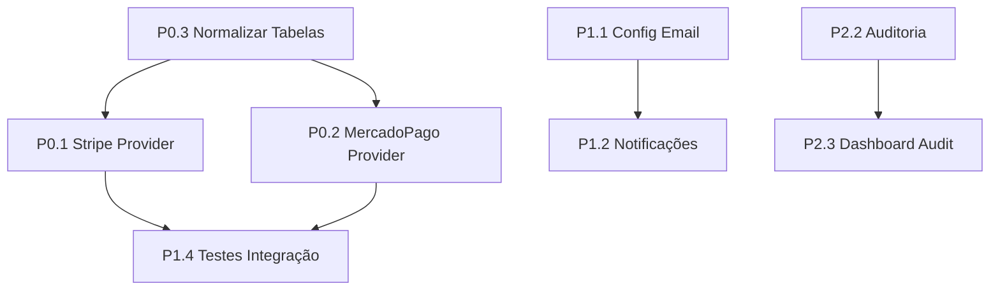

# Plano de Correção - M7consultas

**Data:** 15/12/2025  
**Baseado em:** visao.md (Auditoria Técnica)  
**Versão:** 1.0

---

## Sumário Executivo

Este documento detalha o plano de correção para o sistema M7consultas, organizando todas as tarefas necessárias por prioridade (P0, P1, P2) com passos técnicos específicos para implementação.

---

## P0 - Bloqueadores Críticos

### P0.1 Implementar Stripe Provider

| Campo | Descrição |
|-------|-----------|
| **Objetivo** | Criar provider completo para processamento de pagamentos via Stripe |
| **Complexidade** | L (Large) |
| **Estimativa** | 3-4 dias |

**Arquivos a criar/modificar:**

| Ação | Arquivo |
|------|---------|
| Criar | `app/Contracts/BillingProvider.php` |
| Criar | `app/Services/Billing/StripeProvider.php` |
| Modificar | `app/Services/Billing/BillingService.php` |
| Modificar | `config/services.php` |
| Modificar | `routes/api.php` |
| Modificar | `app/Http/Controllers/WebhookController.php` |
| Modificar | `resources/js/Pages/Subscription.jsx` |
| Criar | `tests/Feature/StripeIntegrationTest.php` |

**Variáveis de ambiente necessárias:**
```env
STRIPE_KEY=pk_live_...
STRIPE_SECRET=sk_live_...
STRIPE_WEBHOOK_SECRET=whsec_...
```

**Passos de implementação:**

1. **Criar interface BillingProvider**
   ```php
   // app/Contracts/BillingProvider.php
   interface BillingProvider {
       public function createCheckoutSession(User $user, Plan $plan): array;
       public function handleWebhook(Request $request): void;
       public function cancelSubscription(Subscription $subscription): bool;
       public function syncPlanPrices(Plan $plan): void;
   }
   ```

2. **Implementar StripeProvider**
   - Usar SDK oficial `stripe/stripe-php`
   - Implementar createCheckoutSession com metadata
   - Criar PaymentIntent para pagamentos únicos
   - Implementar subscription management

3. **Configurar webhook handler**
   - Verificar assinatura do webhook
   - Processar eventos: `payment_intent.succeeded`, `payment_intent.failed`, `customer.subscription.created`, `customer.subscription.deleted`

4. **Atualizar BillingService**
   - Implementar factory pattern para providers
   - Despachar para provider correto baseado em configuração

5. **Ajustar frontend**
   - Usar Stripe.js para checkout seguro
   - Redirecionar para Stripe Checkout ou usar Elements

6. **Criar testes de integração**
   - Mockar respostas da API Stripe
   - Testar fluxo completo de checkout

**Dependências:** P0.3 (normalização de tabelas)

---

### P0.2 Implementar MercadoPago Provider

| Campo | Descrição |
|-------|-----------|
| **Objetivo** | Suportar checkout e pagamentos via MercadoPago |
| **Complexidade** | L (Large) |
| **Estimativa** | 3-4 dias |

**Arquivos a criar/modificar:**

| Ação | Arquivo |
|------|---------|
| Criar | `app/Services/Billing/MercadoPagoProvider.php` |
| Modificar | `app/Services/Billing/BillingService.php` |
| Modificar | `app/Http/Controllers/WebhookController.php` |
| Modificar | `config/services.php` |
| Modificar | `database/seeders/GatewaySeeder.php` |
| Modificar | `resources/js/Pages/Subscription.jsx` |
| Criar | `tests/Feature/MercadoPagoIntegrationTest.php` |

**Variáveis de ambiente necessárias:**
```env
MERCADOPAGO_ACCESS_TOKEN=APP_USR-...
MERCADOPAGO_WEBHOOK_SECRET=...
MERCADOPAGO_PUBLIC_KEY=APP_USR-...
```

**Passos de implementação:**

1. **Instalar SDK oficial**
   ```bash
   composer require mercadopago/dx-php
   ```

2. **Implementar MercadoPagoProvider**
   - Usar SDK oficial para criar preferências
   - Mapear estados de pagamento para enum interno:
     - `approved` → `completed`
     - `pending` → `pending`
     - `rejected` → `failed`
     - `cancelled` → `cancelled`

3. **Processar webhooks**
   - Validar notificação IPN
   - Processar eventos: `payment`, `merchant_order`
   - Atualizar status de subscription/payment

4. **Atualizar frontend**
   - Adicionar seletor de provider (Stripe/MercadoPago)
   - Integrar MercadoPago Checkout Pro

5. **Criar testes**
   - Mockar respostas do SDK
   - Testar webhooks com payloads reais

**Dependências:** P0.1 (abstração de provider), P0.3 (normalização de tabelas)

---

### P0.3 Normalizar Fluxo de Pagamento e Tabelas

| Campo | Descrição |
|-------|-----------|
| **Objetivo** | Garantir estrutura consistente para múltiplos providers |
| **Complexidade** | M (Medium) |
| **Estimativa** | 1-2 dias |

**Arquivos a criar/modificar:**

| Ação | Arquivo |
|------|---------|
| Criar | `database/migrations/xxxx_add_provider_columns_to_payments.php` |
| Criar | `database/migrations/xxxx_add_provider_columns_to_subscriptions.php` |
| Modificar | `app/Models/Payment.php` |
| Modificar | `app/Models/Subscription.php` |
| Modificar | `database/seeders/GatewaySeeder.php` |
| Modificar | `app/Http/Controllers/Admin/AdminGatewayController.php` |

**Passos de implementação:**

1. **Criar migrations**
   ```php
   // Adicionar à tabela payments
   $table->string('provider')->default('manual');
   $table->string('provider_reference')->nullable();
   $table->json('raw_payload')->nullable();
   
   // Adicionar à tabela subscriptions
   $table->string('provider')->default('manual');
   $table->string('provider_subscription_id')->nullable();
   ```

2. **Atualizar Models**
   - Adicionar casts para JSON
   - Adicionar scopes por provider
   - Atualizar fillable/hidden

3. **Atualizar Seeders**
   - Popular gateway_settings com configs de Stripe/MP
   - Criar dados de teste para cada provider

4. **Revisar serviços**
   - Garantir que todos os serviços persistam provider correto
   - Atualizar status de forma consistente

5. **Criar testes**
   - Testar migrations up/down
   - Testar scopes e relationships

**Dependências:** Nenhuma (executar primeiro)

---

## P1 - Necessários para MVP

### P1.1 Configurar Envio de Email

| Campo | Descrição |
|-------|-----------|
| **Objetivo** | Habilitar envio de emails transacionais |
| **Complexidade** | M (Medium) |
| **Estimativa** | 1 dia |

**Arquivos a criar/modificar:**

| Ação | Arquivo |
|------|---------|
| Modificar | `.env` |
| Modificar | `config/mail.php` |
| Criar | `app/Services/MailService.php` (opcional) |
| Criar | `tests/Feature/MailSmokeTest.php` |

**Variáveis de ambiente necessárias:**
```env
MAIL_MAILER=smtp
MAIL_HOST=smtp.mailtrap.io
MAIL_PORT=587
MAIL_USERNAME=
MAIL_PASSWORD=
MAIL_ENCRYPTION=tls
MAIL_FROM_ADDRESS=noreply@m7consultas.com
MAIL_FROM_NAME="${APP_NAME}"
```

**Passos de implementação:**

1. Configurar driver SMTP (Mailtrap para dev, SendGrid/Mailgun para prod)
2. Criar MailService wrapper (opcional)
3. Testar envio com tinker
4. Criar smoke test para verificar conectividade

**Dependências:** Nenhuma

---

### P1.2 Notificações de Pagamento

| Campo | Descrição |
|-------|-----------|
| **Objetivo** | Notificar usuários sobre status de pagamentos |
| **Complexidade** | M (Medium) |
| **Estimativa** | 1-2 dias |

**Arquivos a criar/modificar:**

| Ação | Arquivo |
|------|---------|
| Criar | `app/Mail/PaymentApprovedMail.php` |
| Criar | `app/Mail/PaymentFailedMail.php` |
| Criar | `app/Mail/SubscriptionActivatedMail.php` |
| Criar | `app/Mail/SubscriptionCancelledMail.php` |
| Criar | `resources/views/emails/payment-approved.blade.php` |
| Criar | `resources/views/emails/payment-failed.blade.php` |
| Modificar | `app/Services/Billing/BillingService.php` |
| Criar | `tests/Feature/PaymentNotificationTest.php` |

**Passos de implementação:**

1. **Criar Mailables**
   ```bash
   php artisan make:mail PaymentApprovedMail --markdown=emails.payment-approved
   php artisan make:mail PaymentFailedMail --markdown=emails.payment-failed
   ```

2. **Criar templates de email**
   - Design consistente com marca
   - Incluir detalhes do pagamento/assinatura
   - Adicionar links para dashboard

3. **Integrar com BillingService**
   - Disparar emails após aprovação/rejeição
   - Usar Queue para envio assíncrono

4. **Criar testes**
   - Verificar envio após ações
   - Testar conteúdo dos emails

**Dependências:** P1.1 (configuração de email)

---

### P1.3 Estratégia de Backup sample.db

| Campo | Descrição |
|-------|-----------|
| **Objetivo** | Implementar backup automático do banco de consultas |
| **Complexidade** | S (Small) |
| **Estimativa** | 0.5 dia |

**Arquivos a criar/modificar:**

| Ação | Arquivo |
|------|---------|
| Criar | `app/Console/Commands/SampleDbBackup.php` |
| Modificar | `app/Console/Kernel.php` |

**Passos de implementação:**

1. **Criar comando Artisan**
   ```bash
   php artisan make:command SampleDbBackup
   ```

2. **Implementar lógica de backup**
   ```php
   // Copiar sample.db para storage/app/backups/
   // Nomear com timestamp: sample_20251215_120000.db
   // Manter últimos 7 backups
   ```

3. **Agendar no Kernel**
   ```php
   $schedule->command('sample-db:backup')->daily();
   ```

4. **Criar diretório de backups**
   ```bash
   mkdir -p storage/app/backups
   ```

**Dependências:** Nenhuma

---

### P1.4 Testes de Integração Essenciais

| Campo | Descrição |
|-------|-----------|
| **Objetivo** | Aumentar cobertura de testes do sistema |
| **Complexidade** | M (Medium) |
| **Estimativa** | 2-3 dias |

**Arquivos a criar:**

| Arquivo | Descrição |
|---------|-----------|
| `tests/Feature/ConsultaIntegrationTest.php` | Testes de consultas |
| `tests/Feature/SubscriptionFlowTest.php` | Fluxo de assinaturas |
| `tests/Feature/AdminActionsTest.php` | Ações administrativas |
| `tests/Feature/UsageLimitTest.php` | Limites de uso |
| `tests/Unit/ConsultaServiceTest.php` | Unit tests do serviço |

**Passos de implementação:**

1. **Configurar ambiente de teste**
   - Criar sample.db de teste com dados limitados
   - Configurar database connection para testes

2. **Criar testes de consulta**
   - Testar busca por CPF, telefone, email
   - Testar limites de uso
   - Testar cache de resultados

3. **Criar testes de assinatura**
   - Testar criação de assinatura
   - Testar cancelamento
   - Testar renovação

4. **Criar testes admin**
   - Testar CRUD de usuários
   - Testar CRUD de planos
   - Testar aprovação de pagamentos

**Dependências:** P0.1, P0.2 (para testes de pagamento)

---

### P1.5 Corrigir Workflow Startup

| Campo | Descrição |
|-------|-----------|
| **Objetivo** | Resolver problema de porta ocupada no startup |
| **Complexidade** | S (Small) |
| **Estimativa** | 0.5 dia |

**Arquivos a criar/modificar:**

| Ação | Arquivo |
|------|---------|
| Criar | `scripts/start-server.sh` |
| Modificar | `README.md` |
| Criar | `app/Console/Commands/ServeEnsureFreePort.php` (opcional) |

**Passos de implementação:**

1. **Criar script de startup**
   ```bash
   #!/bin/bash
   # scripts/start-server.sh
   pkill -f "php artisan serve" 2>/dev/null || true
   pkill -f "npm run dev" 2>/dev/null || true
   sleep 1
   npm run dev &
   php artisan serve --host=0.0.0.0 --port=5000
   ```

2. **Atualizar documentação**
   - Adicionar instruções no README
   - Documentar troubleshooting

3. **(Opcional) Criar comando Artisan**
   ```php
   // php artisan serve:ensure-free-port
   // Mata processos na porta 5000 antes de iniciar
   ```

**Dependências:** Nenhuma

---

## P2 - Melhorias

### P2.1 Rate Limiting por IP

| Campo | Descrição |
|-------|-----------|
| **Objetivo** | Prevenir abuso de API por IP |
| **Complexidade** | S (Small) |
| **Estimativa** | 0.5 dia |

**Arquivos a criar/modificar:**

| Ação | Arquivo |
|------|---------|
| Criar | `app/Http/Middleware/RateLimitByIp.php` |
| Modificar | `app/Http/Kernel.php` |
| Criar | `config/ratelimit.php` |

**Passos de implementação:**

1. **Criar middleware**
   ```php
   // Usar RateLimiter do Laravel
   // Configurar limites por rota/grupo
   // Retornar 429 Too Many Requests
   ```

2. **Configurar limites**
   ```php
   // config/ratelimit.php
   return [
       'api' => [
           'max_attempts' => 60,
           'decay_minutes' => 1,
       ],
       'auth' => [
           'max_attempts' => 5,
           'decay_minutes' => 1,
       ],
   ];
   ```

3. **Registrar middleware**
   - Adicionar ao grupo de rotas API
   - Aplicar em rotas de autenticação

**Dependências:** Nenhuma

---

### P2.2 Auditoria Completa

| Campo | Descrição |
|-------|-----------|
| **Objetivo** | Registrar todas as ações do sistema |
| **Complexidade** | M (Medium) |
| **Estimativa** | 1-2 dias |

**Arquivos a criar/modificar:**

| Ação | Arquivo |
|------|---------|
| Criar | `database/migrations/xxxx_create_admin_audit_logs.php` |
| Criar | `app/Observers/UserObserver.php` |
| Criar | `app/Observers/SubscriptionObserver.php` |
| Criar | `app/Observers/PaymentObserver.php` |
| Modificar | `app/Providers/EventServiceProvider.php` |
| Modificar | `app/Http/Middleware/ApiAuditLog.php` |

**Passos de implementação:**

1. **Criar tabela admin_audit_logs**
   ```php
   $table->id();
   $table->foreignId('user_id')->nullable();
   $table->string('action');
   $table->string('model_type');
   $table->unsignedBigInteger('model_id')->nullable();
   $table->json('old_values')->nullable();
   $table->json('new_values')->nullable();
   $table->string('ip_address')->nullable();
   $table->timestamps();
   ```

2. **Criar Observers**
   - Registrar created, updated, deleted events
   - Capturar valores antigos/novos
   - Incluir usuário e IP

3. **Ativar middleware de audit**
   - Registrar todas as requisições API
   - Incluir tempo de resposta

**Dependências:** Nenhuma

---

### P2.3 Dashboard de Auditoria

| Campo | Descrição |
|-------|-----------|
| **Objetivo** | Interface para visualização de logs |
| **Complexidade** | M (Medium) |
| **Estimativa** | 1-2 dias |

**Arquivos a criar/modificar:**

| Ação | Arquivo |
|------|---------|
| Criar | `app/Http/Controllers/Admin/AdminAuditController.php` |
| Criar | `resources/js/Pages/Admin/Audit.jsx` |
| Modificar | `routes/web.php` |

**Passos de implementação:**

1. **Criar controller**
   - Listar logs com paginação
   - Filtrar por usuário, ação, data
   - Exportar para CSV

2. **Criar página React**
   - Tabela com logs
   - Filtros de busca
   - Botão de exportação

3. **Adicionar rota**
   ```php
   Route::get('/admin/audit', [AdminAuditController::class, 'index']);
   ```

**Dependências:** P2.2 (auditoria completa)

---

### P2.4 Validação de Integridade sample.db

| Campo | Descrição |
|-------|-----------|
| **Objetivo** | Verificar integridade do banco de consultas |
| **Complexidade** | S (Small) |
| **Estimativa** | 0.5 dia |

**Arquivos a criar/modificar:**

| Ação | Arquivo |
|------|---------|
| Criar | `app/Console/Commands/SampleDbIntegrityCheck.php` |
| Modificar | `app/Console/Kernel.php` |

**Passos de implementação:**

1. **Criar comando**
   ```php
   // php artisan sample-db:check-integrity
   // Calcular MD5/SHA256 do arquivo
   // Comparar com valor armazenado
   // Verificar estrutura das tabelas
   // Alertar via log/notification se inválido
   ```

2. **Agendar verificação semanal**
   ```php
   $schedule->command('sample-db:check-integrity')->weekly();
   ```

3. **Armazenar checksum**
   - Em arquivo `.checksum`
   - Ou em system_settings

**Dependências:** Nenhuma

---

## Ordem de Execução Recomendada



### Sprint 1 (Semana 1-2)
1. P0.3 - Normalizar tabelas (pré-requisito)
2. P1.1 - Configurar email
3. P1.3 - Backup sample.db
4. P1.5 - Corrigir workflow
5. P2.1 - Rate limiting

### Sprint 2 (Semana 3-4)
1. P0.1 - Stripe Provider
2. P1.2 - Notificações de pagamento
3. P2.2 - Auditoria completa

### Sprint 3 (Semana 5-6)
1. P0.2 - MercadoPago Provider
2. P1.4 - Testes de integração
3. P2.3 - Dashboard de auditoria
4. P2.4 - Validação de integridade

---

## Checklist de Conclusão

### P0 - Críticos
- [x] P0.1 - Stripe Provider implementado e testado
- [x] P0.2 - MercadoPago Provider implementado e testado
- [x] P0.3 - Migrations aplicadas e testadas

### P1 - MVP
- [x] P1.1 - Emails funcionando (Laravel Mail configurado)
- [x] P1.2 - Notificações de pagamento ativas (PaymentObserver)
- [ ] P1.3 - Backup automático configurado (REMOVIDO - banco de dev)
- [x] P1.4 - Testes de integração criados
- [x] P1.5 - Workflow funcionando

### P2 - Melhorias
- [ ] P2.1 - Rate limiting ativo
- [ ] P2.2 - Auditoria registrando ações
- [ ] P2.3 - Dashboard de auditoria funcional
- [ ] P2.4 - Verificação de integridade agendada

---

## Implementações Realizadas (16/12/2025) - Parte 2: Módulos History e Settings

### Novas Funcionalidades Implementadas

#### 1. Módulo History - Melhorias
| Funcionalidade | Descrição |
|----------------|-----------|
| **Soft Deletes** | Registros podem ser recuperados após exclusão |
| **Lazy Loading** | Scroll infinito com paginação cursor-based determinística |
| **API cursor-based** | Endpoint `/api/history?cursor=TOKEN&per_page=20` |
| **Cursor composto** | Token base64 com timestamp + id para ordenação determinística |
| **Tie-breaker** | Ordenação `created_at DESC, id DESC` evita duplicatas/gaps |
| **Remoção individual** | Usuário pode remover itens específicos |
| **Sincronização** | Frontend sincroniza estado com props do servidor |

#### 2. Módulo Settings - Nova Arquitetura
| Rota | Funcionalidade |
|------|----------------|
| `/profile` | Dados pessoais (nome, email, telefone) |
| `/settings` | Preferências, notificações, segurança |
| `/settings/preferences` | Tema, idioma, fuso horário |
| `/settings/notifications` | Email e push notifications |
| `/settings/security` | Alteração de senha e 2FA |

#### 3. Arquivos Criados
| Arquivo | Descrição |
|---------|-----------|
| `database/migrations/2025_12_16_032938_create_user_settings_table.php` | Tabela de configurações do usuário |
| `database/migrations/2025_12_16_032940_add_soft_deletes_to_consulta_histories_table.php` | Soft deletes para histórico |
| `app/Models/UserSettings.php` | Model com preferências do usuário |
| `app/Http/Controllers/SettingsController.php` | Controller para configurações |
| `resources/js/Pages/Profile.jsx` | Página de perfil do usuário |

#### 4. Arquivos Modificados
| Arquivo | Alteração |
|---------|-----------|
| `app/Models/ConsultaHistory.php` | Adicionado SoftDeletes e scope withCursor |
| `app/Models/User.php` | Adicionado relação settings() e getSettings() |
| `app/Http/Controllers/PageController.php` | Métodos profile() e updateProfile() |
| `app/Http/Controllers/Api/HistoryController.php` | Paginação cursor-based |
| `resources/js/Pages/Settings.jsx` | Totalmente refatorado com abas |
| `resources/js/Pages/History.jsx` | Lazy loading implementado |
| `resources/js/Components/layout.tsx` | Navegação separada Profile/Settings |
| `routes/web.php` | Novas rotas para settings e profile |

---

## Implementações Anteriores (15/12/2025) - Sistema de Pagamentos

### Arquivos Criados
| Arquivo | Descrição |
|---------|-----------|
| `app/Services/Billing/StripeProvider.php` | Provider completo para Stripe com checkout, webhooks e refund |
| `app/Services/Billing/MercadoPagoProvider.php` | Provider completo para MercadoPago com checkout, webhooks e refund |
| `app/Services/Billing/BillingService.php` | Serviço central para gerenciar múltiplos providers |
| `app/Services/NotificationService.php` | Serviço para envio de notificações por email |
| `app/Mail/PaymentApprovedMail.php` | Email de pagamento aprovado |
| `app/Mail/PaymentFailedMail.php` | Email de pagamento rejeitado |
| `app/Mail/SubscriptionActivatedMail.php` | Email de assinatura ativada |
| `app/Observers/PaymentObserver.php` | Observer para disparar emails automaticamente |
| `resources/views/emails/payment-approved.blade.php` | Template email aprovado |
| `resources/views/emails/payment-failed.blade.php` | Template email rejeitado |
| `resources/views/emails/subscription-activated.blade.php` | Template email ativação |
| `tests/Feature/SubscriptionFlowTest.php` | Testes de fluxo de assinatura |
| `tests/Feature/ConsultaIntegrationTest.php` | Testes de integração de consultas |
| `tests/Feature/AdminActionsTest.php` | Testes de ações administrativas |

### Arquivos Modificados
| Arquivo | Alteração |
|---------|-----------|
| `app/Http/Controllers/Api/WebhookController.php` | Integração com BillingService |
| `app/Http/Controllers/Api/UserSubscriptionController.php` | Suporte a múltiplos providers |
| `app/Http/Controllers/Admin/AdminPageController.php` | testGateway() com teste real de API |
| `app/Providers/AppServiceProvider.php` | Registro do PaymentObserver |

### Dependências Adicionadas
- `stripe/stripe-php` v19.x
- `mercadopago/dx-php` v3.8.x

---

*Documento atualizado em 16/12/2025*
